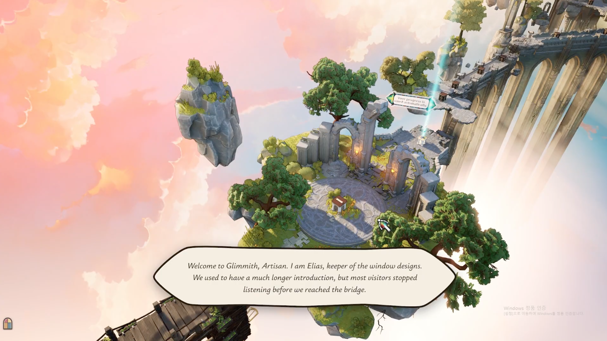
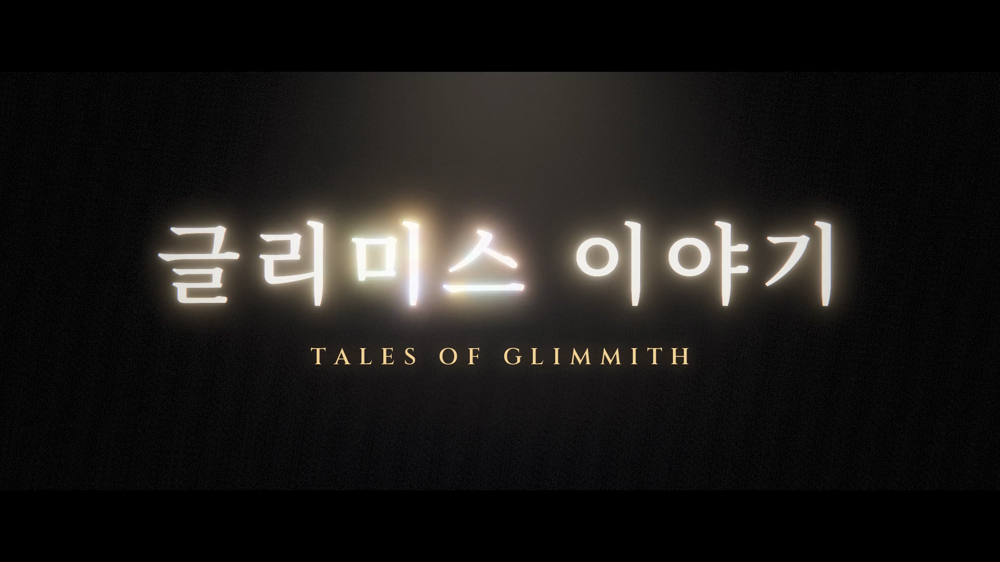

# Glimmith Narrator

A companion for **The Artisan of Glimmith** that brings Elias to life as you play — a beautiful story told in his own voice, narrated right alongside you the moment you actually reach that point in the game, for a deeper sense of immersion.

▶️ [Watch the demo video](https://www.youtube.com/watch?v=frVgAVe1fgA)

## Features

- **Live narration overlay** — a frameless, click-through subtitle box appears at the bottom of the screen with matching voice-over (87 lines, `N01`–`N87`) as you solve puzzles and progress through the game.
- **Korean & English** — narration language follows the game's own UI language setting automatically.
- **Zero setup** — auto-detects your save folder (`%LOCALAPPDATA%\Geri\Saved\SaveGames`) on launch. Portable `.exe`, nothing to install.
- **Read-only & safe** — never writes to your save file; watches it, nothing more.
- **Tray menu** — open the log file, open the watched saves folder, **Reset progress** (forgets which lines this app has already played, without touching your game save), and Quit.

## Download

Grab the latest portable `.exe` from [Releases](https://github.com/kairess/glimmith-narrator/releases/latest) and run it — no installer. It sits in the system tray while you play.

> The build is self-signed (not yet a trusted CA), so Windows SmartScreen may show an "unknown publisher" warning on first run.

## Voice

Narration is generated with [ElevenLabs](https://elevenlabs.io) using the **Cornelius (British)** voice (`eleven_multilingual_v2` model).

## Story trailer

The whole tale of Glimmith in under four minutes — Elias's narration with Korean subtitles, from the first welcome to the colours that are yours.

▶️ [Watch the story trailer](https://youtu.be/A8jC71NQoqM)

Every frame and sound is generated from code — GLSL shaders for the stained glass, city and shattering, and numpy synthesis for the score and sound design; no image or video generation models. Source is in [`trailer/src/`](trailer/src/) (`pip install -r requirements.txt`, then `audio.py` → `render.py` → `mux.sh`); it expects the free variable-weight fonts [Noto Serif KR](https://fonts.google.com/noto/specimen/Noto+Serif+KR) and [Cinzel](https://fonts.google.com/specimen/Cinzel) as `trailer/fonts/NotoSerifKR.ttf` and `trailer/fonts/Cinzel.ttf`.

## Development

See [`app/README.md`](app/README.md) for running from source, testing against a sample save, and building the Windows executable.
